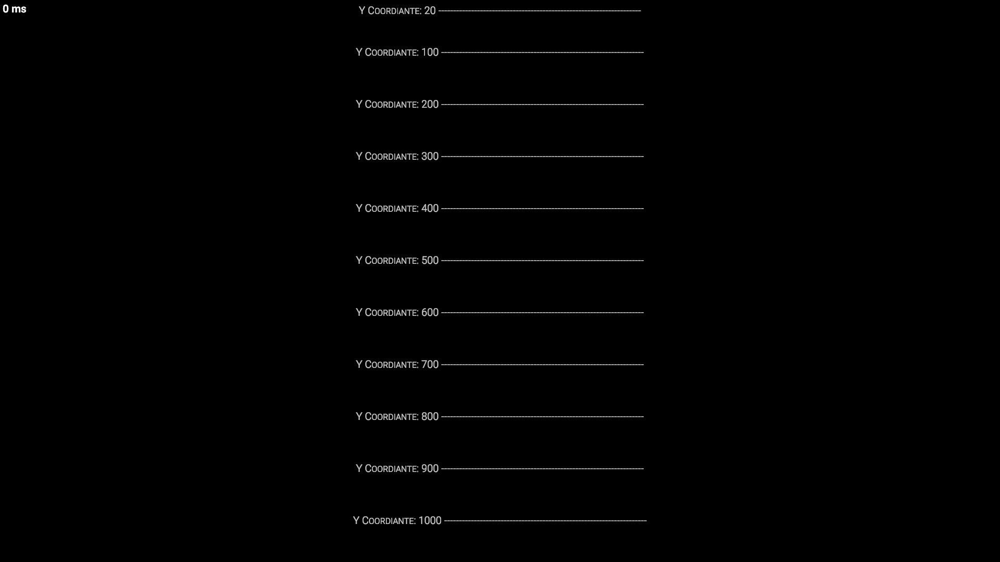

# 文档
本文件介绍了 HintServiceMeow 的使用和功能。
## Hint
Hint 是一个基本功能，允许您在玩家的屏幕上特定位置添加文本。以下示例将文本添加到玩家屏幕的左下方。
```Csharp
 Hint hint = new Hint
 {
     Text = "Hello World",
     FontSize = 40,
     YCoordinate = 700,
     Alignment = HintAlignment.Left
 };

 PlayerDisplay playerDisplay = PlayerDisplay.Get(player);
 playerDisplay.AddHint(hint);
```
由于 HSM 具有自动更新功能，任何属性的更改（如 Text、FontSize、Alignment 等）都会自动反映在玩家的屏幕上，无需再调用任何方法。
```Csharp
hint.Text = "Some New Text";
// 更新属性后无需调用任何方法
``` 
#### 属性
| 属性 | 描述 |
| - | - |
| Guid (只读) | 为Hint生成的 Guid |
| Id | 自定义字符串 ID |
| SyncSpeed | 提示更新的优先级。越快，内容更新后显示更新的速度越快 |
| FontSize | 文本的大小 |
| LineHeight | 每行文本之间的额外间距 |
| Content | 提示的内容。提示显示的文本将从此属性中获取。 |
| Text | 设置此属性将用静态文本覆盖内容。 |
| AutoText | 设置此属性将用字符串委托覆盖内容。 |
| Hide | 是否隐藏该提示 |
| XCoordinate | 文本的水平位置。X 坐标越大，文本显示越靠右 |
| YCoordinate | 文本的垂直位置。Y 坐标越大，文本显示越靠下  |
| Alignment | 文本的对齐方式 |
| YCoordinateAlign | 文本对 Y 坐标的对齐方式。例如，Top 表示 Y 坐标代表文本的顶部
 |
## DynamicHint
动态提示允许您显示文本而无需指定固定位置。动态提示会自动定位在屏幕上不会与其他文本元素重叠的区域，确保最佳可读性。以下示例在玩家屏幕上添加文本而不设置固定位置。
```CSharp
var dynamicHint = new DynamicHint
{
    Text = "Hello Dynamic Hint"
};

PlayerDisplay playerDisplay = PlayerDisplay.Get(player);
playerDisplay.AddHint(dynamicHint);
```
#### Properties
| Properties | Description |
| - | - |
| Guid (只读) | 为Hint生成的 Guid |
| Id | 自定义字符串 ID |
| SyncSpeed | 提示更新的优先级。越快，内容更新后显示更新的速度越快 |
| FontSize | 文本的大小 |
| LineHeight | 每行文本之间的额外间距 |
| Content | 提示的内容。提示显示的文本将从此属性中获取。 |
| Text | 设置此属性将用静态文本覆盖内容。 |
| AutoText | 设置此属性将用字符串委托覆盖内容。 |
| Hide | 是否隐藏该提示 |
| TopBoundary, BottomBoundary, LeftBoundary, RightBoundary | DynamicHint提示用于排列文本的边界 |
| TargetX, TargetY | 动态提示将尝试向这些坐标移动，但最终位置取决于可用空间。 |
| TopMargin, BottomMargin, LeftMargin, RightMargin | DynamicHint在排版时时为其周围添加的额外空间 |
| Priority | 动态提示的优先级。优先级越高，排列顺序越靠前 |
| Strategy | 动态提示在排列时使用的策略 |
## CommonHint
CommonHint 是一个组件，允许您在预设位置显示文本。以下示例使用 CommonHint 向玩家显示多个信息。
```CSharp
var ui = PlayerUI.Get(player);
ui.CommonHint.ShowRoleHint("SCP173", new[] { "K杀死所有人类", "使用你的技能" });
ui.CommonHint.ShowMapHint("重型收容区", "收容大多数 SCP 的区域");
ui.CommonHint.ShowItemHint("钥匙卡", "用于解锁门");
ui.CommonHint.ShowOtherHint("服务器正在启动！");
```